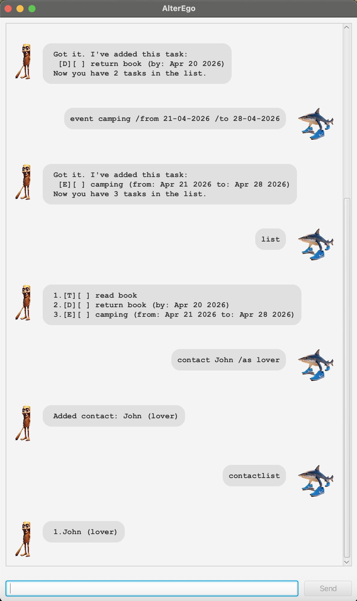

# alterego.AlterEgo User Guide

// Product screenshot goes here


AlterEgo is a **desktop chatbot app** for managing tasks and contacts, optimized for use via a **Command Line Interface (CLI)** while having the benefits of a **Graphical User Interface (GUI)**.

// Product intro goes here
## Features

### 📋 Task Management

#### Add task:
- **Todo**: todo {description}
    - Example: `todo read book`
- **Deadline**: {description} /by {date, dd-MM-yyyy format}
    - Example: `deadline return book /by 25-03-2024`
- **Event**: {description} /from {date, dd-MM-yyyy format} /to {date, dd-MM-yyyy format}
    - Example: `event camp /from 01-04-2024 /to 05-04-2024`
    - ⚠️ Note: Overlapping events will trigger a warning
#### Delete task:
- delete t{index}
    - Example: `delete t1`
#### Update task doneness:
- **Mark as done**: `mark {index}`
    - Example: `mark 1`
- **Mark as not done**: `unmark {index}`
    - Example: `unmark 1`
#### Find task:
- `find {keyword}`
    - Keyword can be any part of the task label, including date
    - Example: `find book`, `find 25-03`
#### View all task:
- `list`

### 👥 Contact Management

#### Add contact:
- `contact {name} /as {relationship}`
    - Example: `contact John /as Friend`
#### Delete contact:
- `delete c{index}`
    - Example: `delete c1`
#### Assign contact for a task:
- `assign t{index} /to {name}`
    - Example: `assign t1 /to John`
#### View all contacts:
- `contactlist`
    - Example: `contactlist`

### 🛠️ Miscellaneous

#### Show all commands:
- `help`
    - Example: `help`
#### Clear all data:
- `clear`
    - ⚠️ Warning: This permanently deletes all tasks and contacts from storage
    - Example: `clear`
#### Exit application:
- `bye`
    - Example: `bye`

// A description of the expected outcome goes here

```
expected output
```

## Feature ABC

// Feature details


## Feature XYZ

// Feature details
